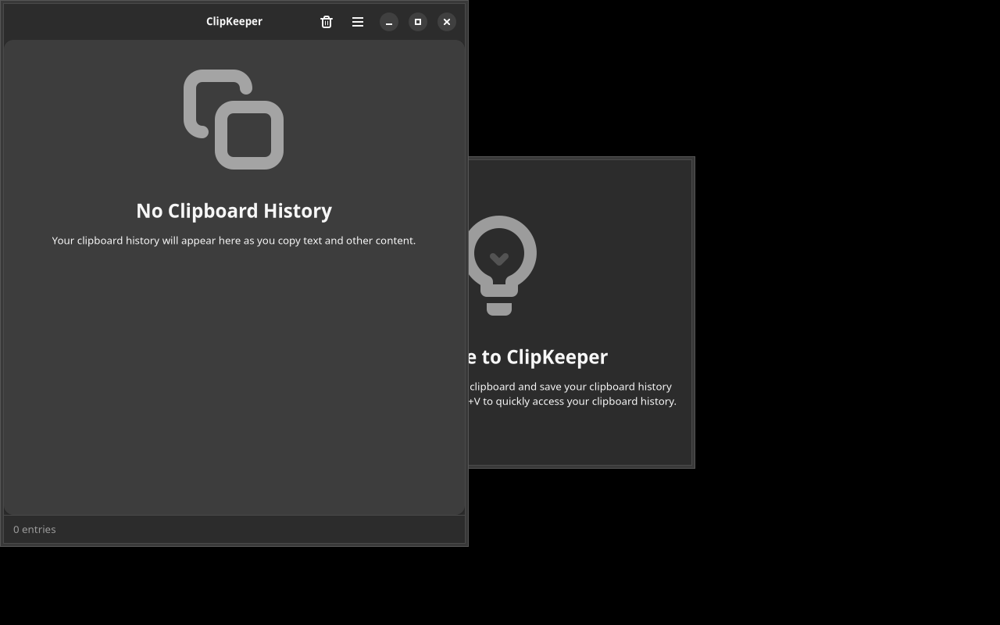

# ClipKeeper

A modern GTK4/Adwaita clipboard manager for Linux that keeps track of your clipboard history.



## Features

**Clipboard History**
• Monitor clipboard automatically
• Store last 500 entries (configurable)
• Support for text, images, URLs, and code

**Smart Search**
• Instant search through history (Ctrl+F)
• Filter by content type
• Find exactly what you need

**Pin Important Items**
• Star frequently used clips
• Pinned items never expire
• Keep important snippets accessible

**Content Recognition**
• Auto-detect URLs, code, colors
• Visual icons for different types
• Smart categorization

**System Integration**
• Global hotkey (Ctrl+Shift+V)
• Optional system tray indicator
• Follow system dark/light theme

**GNOME Integration**
• Beautiful Adwaita interface
• Follows GNOME HIG guidelines
• Keyboard shortcuts help (Ctrl+?)

## Installation

### Requirements

• Python 3.9 or newer
• GTK 4.0
• libadwaita 1.0
• PyGObject

### From Source

```bash
git clone https://github.com/yeager/clipkeeper.git
cd clipkeeper
pip install .
```

### Ubuntu/Debian

```bash
sudo apt install python3-gi python3-gi-cairo gir1.2-gtk-4.0 gir1.2-adw-1
pip install clipkeeper
```

## Usage

### GUI Application

Launch ClipKeeper:
```bash
clipkeeper
```

**Keyboard Shortcuts:**
• Ctrl+Shift+V - Show/hide ClipKeeper
• Ctrl+F - Search clipboard history  
• Ctrl+Q - Quit application
• Ctrl+? - Show keyboard shortcuts

**Using the Interface:**
• Click any entry to copy it back to clipboard
• Click the star icon to pin/unpin entries
• Use the search bar to filter history
• Access preferences from the menu

### Command Line

**Show version:**
```bash
clipkeeper --version
```

**List clipboard history:**
```bash
clipkeeper --list
```

**Clear history (keeps pinned):**
```bash
clipkeeper --clear
```

## Configuration

ClipKeeper stores its configuration and history in:
• Config: `~/.local/share/clipkeeper/config.json`
• History: `~/.local/share/clipkeeper/history.json`

**Available Settings:**
• Maximum history size (50-2000 entries)
• Auto-start with system
• System tray indicator
• Theme preference (auto/light/dark)

## Development

**Setup development environment:**
```bash
git clone https://github.com/yeager/clipkeeper.git
cd clipkeeper
python3 -m venv venv
source venv/bin/activate
pip install -e .
```

**Run from source:**
```bash
python3 clipkeeper.py
```

## Contributing

Contributions are welcome! Please read our contributing guidelines and submit pull requests to the main repository.

**Translation:**
ClipKeeper uses gettext for internationalization. Translations are managed on [Transifex](https://app.transifex.com/danielnylander/clipkeeper/). See [po/README.md](po/README.md) for details on how to contribute translations.

## License

GPL-3.0-or-later

## Author

Daniel Nylander <daniel@danielnylander.se>